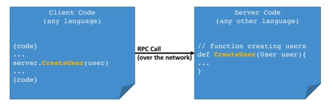
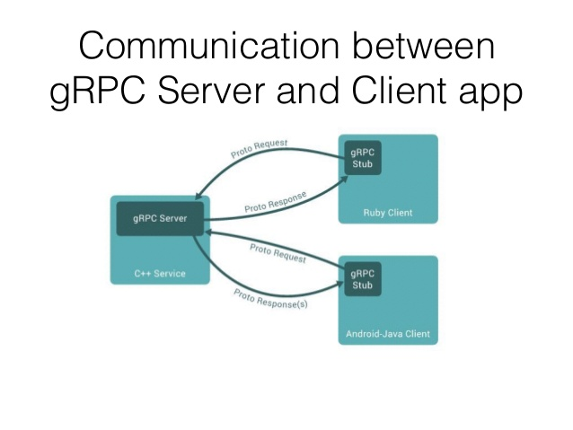

# Cosmos SDK gRPC Introduction


The gRPC helps to get and submit information from the Cosmos SDK. It is a convienient method that let's you avoid having to care about efficiency of an API, latency, scaling, load balancing, interoperability between languages, authenitication, monitoring or logging.
The Cosmos gRPC let's you create functions in the language of your choice and interact with your blockchain application. Let's look at the basics.

## What is an API with gRPC?

At its core, the API is a contract saying: Send me this REQUEST (Client side) and I send you this RESPONSE (Server side).

From here on builds gRPC the logic, developed by Google as a free and open-source project. It supports streaming, language independend and easy to use authentication, load balancing, logging and monitoring. The RPC stands for "Remote Procedure Call". Eventually on the Client it will look like just calling a function directly on the Server.



RPC is not a new concept. Other frameworks and languages have used this in the past and the concept is battle tested. gRPC is a clean implementation of the RPC concet. The protocol is basically defined in Proto Request and Proto Responses, handled by the Server.



## Let's get started

At the core we need to define the gRPC messages and services using Protocol Buffers. The rest of the gRPC code will be generated and we need an implementation for it. The .proto file works for over 12 programming languages server and client side and allows the framework to scale to millions of RPC requests per second.

In order to understand the implementation, we need to look into Protocol Buffers. Protocol Buffers mainly do two things, they define `messages` and `services`. The `messages` are for data, request and response while the `service` is for the name and RPC endpoint.

Let us look at an example Query `service` provided by the Cosmos SDK, from the `bank` module 

https://github.com/cosmos/cosmos-sdk/blob/master/proto/cosmos/bank/v1beta1/query.proto
```protobuf
// Query defines the gRPC querier service.
service Query {
  // Balance queries the balance of a single coin for a single account.
  rpc Balance(QueryBalanceRequest) returns (QueryBalanceResponse) {
    option (google.api.http).get = "/cosmos/bank/v1beta1/balances/{address}/{denom}";
  }

  // AllBalances queries the balance of all coins for a single account.
  rpc AllBalances(QueryAllBalancesRequest) returns (QueryAllBalancesResponse) {
    option (google.api.http).get = "/cosmos/bank/v1beta1/balances/{address}";
  }

  // TotalSupply queries the total supply of all coins.
  rpc TotalSupply(QueryTotalSupplyRequest) returns (QueryTotalSupplyResponse) {
    option (google.api.http).get = "/cosmos/bank/v1beta1/supply";
  }

  // SupplyOf queries the supply of a single coin.
  rpc SupplyOf(QuerySupplyOfRequest) returns (QuerySupplyOfResponse) {
    option (google.api.http).get = "/cosmos/bank/v1beta1/supply/{denom}";
  }

  // Params queries the parameters of x/bank module.
  rpc Params(QueryParamsRequest) returns (QueryParamsResponse) {
    option (google.api.http).get = "/cosmos/bank/v1beta1/params";
  }
}
```

This service provides all available RPC methods for the `bank` module. Let us pick a concrete example from here and look into the `QueryBalanceRequest` and `QueryBalanceResponse` which both are `messages`.

```protobuf
// QueryBalanceRequest is the request type for the Query/Balance RPC method.
message QueryBalanceRequest {
  option (gogoproto.equal)           = false;
  option (gogoproto.goproto_getters) = false;

  // address is the address to query balances for.
  string address = 1;

  // denom is the coin denom to query balances for.
  string denom = 2;
}
```

```protobuf
// QueryBalanceResponse is the response type for the Query/Balance RPC method.
message QueryBalanceResponse {
  // balance is the balance of the coin.
  cosmos.base.v1beta1.Coin balance = 1;
}
```

From this information we can create our Client gRPC in order to get the information of Coins from the `bank` module.
In this tutorial, we will be using JavaScript in order to build our Client and get the information that we want.

Let's init our NodeJS NPM project in our directory of choice with 

```bash
npm init -y
npm i babel-cli babel-preset-es2015 @grpc/grpc-js -s 
```

In order to use ES6 code, let's add a start script to our application. In `package.json`, let's add: 

```json
"scripts": {
    "start": "babel-node --presets es2015 index.js"
}
```

and create the code in our `index.js` file.